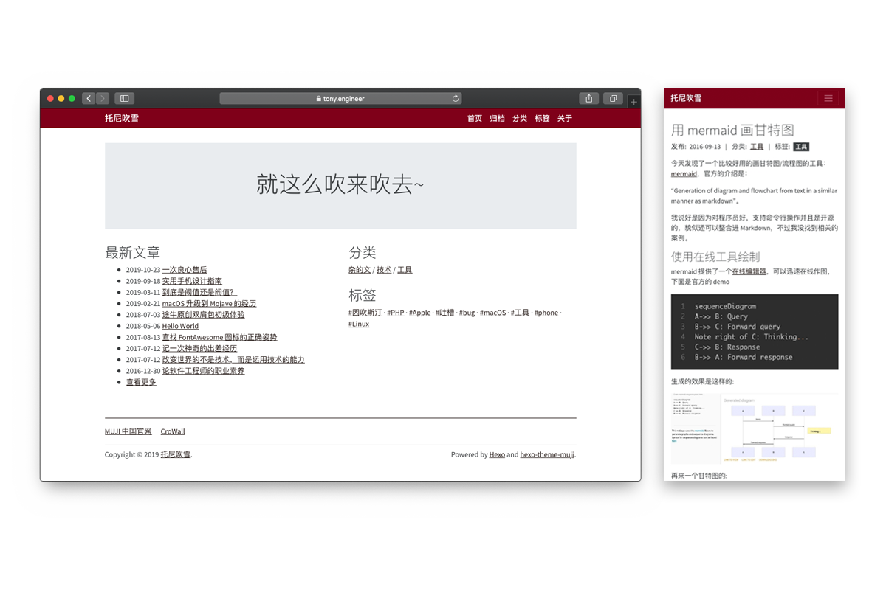

# hexo-theme-muji

> [English Version](README.md)

一款借鉴 MUJI 风格的 Hexo 主题。

### 截图



### 安装

第一步: 下载 `hexo-theme-muji`

```
cd your-hexo-home
git clone https://github.com/lucups/hexo-theme-muji.git themes/muji
```

第二步: 更新全局配置文件 `your-hexo-home/_config.yml`，设置使用 `muji` 主题:

```
theme: muji
```

### 配置

// TODO

### 色彩


### 待办

- [] 首页重构，丰富配置项
- [] 支持搜索功能
- [] 优化移动端显示效果
